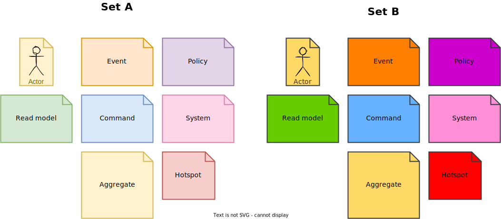

# Event storming templates for diagrams.net's drawio
Here are some simple sticky note templates for the most common components of an event storming session.

Set A is light and Set B is a more solid color.
Both sets should be usable in both light and dark mode.

